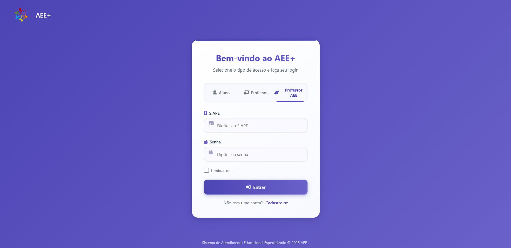
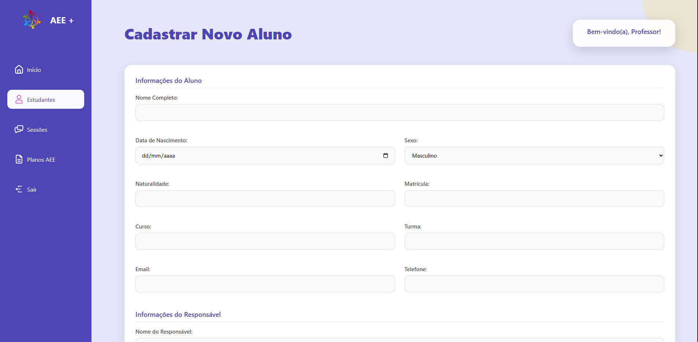
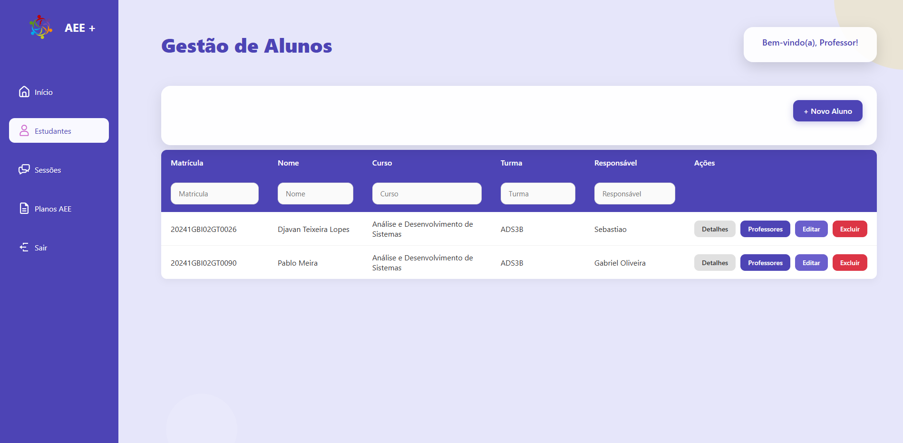
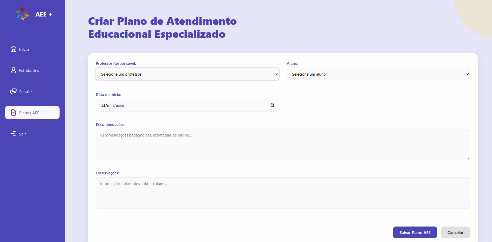
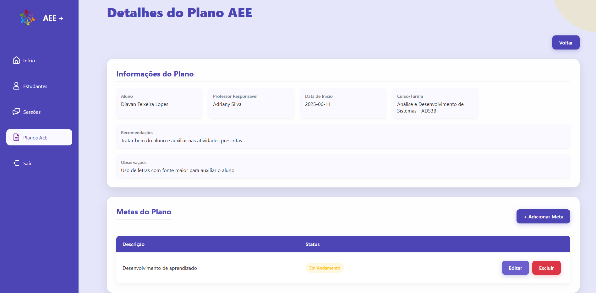
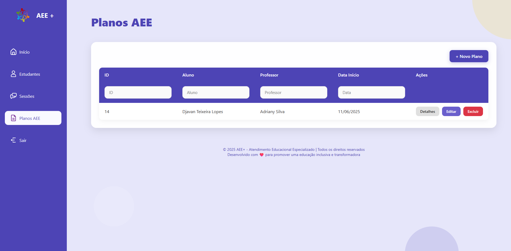
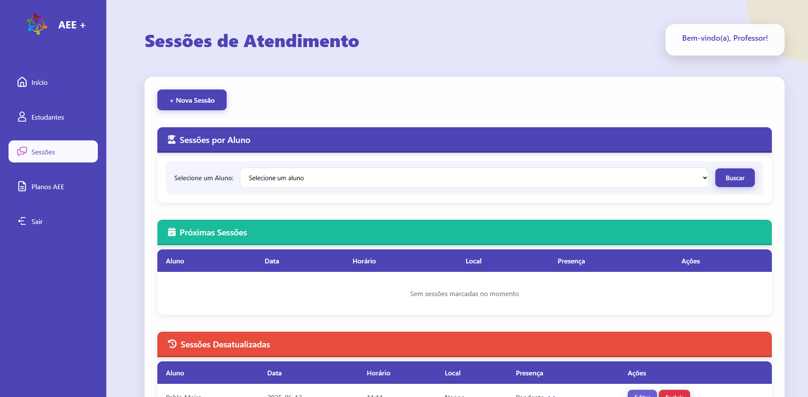

# AEE+
### Sistema de Gestão do Atendimento Educacional Especializado

---

## 📋 Visão Geral

Este repositório contém um sistema para o gerenciamento e monitoramento do **Atendimento Educacional Especializado (AEE)**, com foco no desenvolvimento de cada estudante e na valorização de suas habilidades únicas.

**O que é o Atendimento Educacional Especializado (AEE)?**
> O AEE é uma modalidade de ensino complementar, pensada para oferecer recursos, estratégias e suporte pedagógico individualizado a alunos com deficiência, transtornos globais do desenvolvimento ou altas habilidades/superdotação. Seu objetivo é garantir o acesso, a permanência e o progresso desses estudantes no cotidiano escolar, promovendo a inclusão efetiva e o respeito às suas especificidades.

A plataforma permite que educadores e gestores escolares planejem, acompanhem e documentem todo o processo de AEE de forma simples e eficiente.

---

## 📌 Índice

1. [Requisitos Funcionais](#requisitos-funcionais)
2. [Requisitos Não Funcionais](#requisitos-não-funcionais)
3. [Tecnologias Utilizadas](#tecnologias-utilizadas)
4. [Repositório Online](#repositório-online)
5. [Como Executar o Sistema com Docker](#como-executar-o-sistema-com-docker)
6. [Autor](#autor)

---

## 🎯 Requisitos Funcionais

- **RF01 – Cadastro e Gerenciamento de Alunos**  
  Permitir criação, leitura, atualização e exclusão (CRUD) de registros de alunos, incluindo dados pessoais, diagnóstico, necessidades específicas e contatos de responsáveis.

- **RF02 – CRUD de Planos de AEE (PlanoAEE)**  
  Criar, editar, consultar e excluir planos educacionais individualizados, definindo objetivos, estratégias, recursos e prazos para cada estudante.

- **RF03 – CRUD de Propostas Pedagógicas**  
  Gerenciar propostas pedagógicas complementares: cadastrar atividades, materiais adaptados, metodologias e equipe envolvida.

- **RF04 – Agendamento e Acompanhamento de Sessões**  
  Registrar sessões de atendimento (data, horário, mediador, local), editar detalhes, cancelar e visualizar histórico de encontros.

- **RF05 – Organização de Atendimento**  
  Definir turmas ou grupos de atendimento, vincular alunos às sessões, atribuir profissionais (professores, mediadores ou especialistas) e alocar recursos (salas, equipamentos).

- **RF06 – Geração de Relatórios**  
  Gerar relatórios customizáveis sobre frequência de sessões, cumprimento de metas do PlanoAEE, progresso acadêmico e indicadores de participação, exportáveis em PDF ou planilha.

- **RF07 – Funções de Login**  
  O sistema possibilita cadastro, login e logout de usuários.

- **RF08 – Controle de Acesso por Perfil**  
  Perfis diferenciados (Aluno, Professor AEE, Professor): cada perfil visualiza e altera apenas as seções permitidas.

- **RF09 – Histórico e Linha do Tempo**  
  Exibir, para cada aluno, um painel cronológico com sessões realizadas, alterações de planos, relatórios e pareceres.

- **RF10 – Busca e Filtros Avançados**  
  Permitir pesquisa por aluno, período, tipo de deficiência, status de plano, profissional responsável e filtros combinados.

---

## ⚙️ Requisitos Não Funcionais

- **RNF01 – Usabilidade e Acessibilidade**  
  Interface intuitiva e responsiva para usuários com deficiência visual, auditiva ou motora; navegação por teclado e compatibilidade com leitores de tela.

- **RNF02 – Desempenho**  
  Tempo de resposta para carregamento de páginas e pesquisas abaixo de 2 segundos sob carga média.

- **RNF03 – Escalabilidade e Confiabilidade**  
  Arquitetura que suporte crescimento de usuários e volume de dados.

- **RNF04 – Compatibilidade**  
  Suporte aos principais navegadores (Chrome, Firefox, Edge, Safari) em desktop.

---

## 🛠️ Tecnologias Utilizadas

- **Docker** ([docker.com](https://www.docker.com/))
- **Docker Compose** ([docs.docker.com/compose](https://docs.docker.com/compose/))
- **MySQL 8** ([mysql.com](https://www.mysql.com/))
- **Flyway** ([flywaydb.org](https://flywaydb.org/))
- **Java 17** ([docs.oracle.com](https://docs.oracle.com/en/java/javase/17/))

---

## 🌐 Repositório Online

Acesse o código completo em:

🔗 [GitHub - Sistema de Gestão do AEE](https://github.com/Djavantl/Sistema-de-Gestao-do-Atendimento-Educacional-Especializado.git)

---

## 🚀 Como Executar o Sistema com Docker

1. **Pré-requisitos**
   - Docker instalado
   - Docker Compose instalado
   - Git (opcional)

2. **Clone o repositório**

   ```bash
   git clone https://github.com/Djavantl/Sistema-de-Gestao-do-Atendimento-Educacional-Especializado.git
   cd Sistema-de-Gestao-do-Atendimento-Educacional-Especializado
   ```

3. **Execute o Docker Compose**

   ```bash
   docker-compose up --build
   ```

4. **Acesse o sistema**

Após executar, e o Docker já estiver rodando:

Acesse no navegador:  
[http://localhost:8080/templates/usuarios/SobreNos.jsp](http://localhost:8080/templates/usuarios/SobreNos.jsp)

Na parte inferior da página, escolha entre as opções de **login** ou **cadastro**, conforme sua função.

5. **Credenciais de Acesso (Pré-definidas)**

Dados pré-definidos já foram inseridos para testes.

### 👨‍🎓 Aluno
Utilize uma das seguintes matrículas:
- `ADS20230001`
- `ADS20230002`
- `ADS20230003`
- `ADS20230004`

### 👨‍🏫 Professor
Utilize um dos seguintes SIAPEs:
- `SP987654321`
- `PE876543210`
- `BA765432109`
- `DF654321098`

### 🧑‍🏫 Professor AEE
Utilize o SIAPE:
- `SC543210987`

> ⚠️ A senha deverá ser criada na página de **cadastro**, caso ainda não tenha sido cadastrada. Após o cadastro, realize o login com os dados fornecidos.

Agora é só utilizar o sistema! ✅

---

## 👨‍💻 Autor

Projeto realizado como **atividade avaliativa** da disciplina _Linguagem de Programação Orientada a Objetos_.

Desenvolvido por:
- Aparecida
- Djavan Teixeira Lopes
- Gabriel Rocha Gomes
- Marley Teixeira Meira
- Pablo Henrique Azevedo Gomes da Silva

**Orientação:** Prof. Woquiton Lima Fernandes

## 📸 Demonstração Visual

### Tela de Login


### Cadastro e Gestão de Alunos



### Planos de AEE




### Sessões de Atendimento
